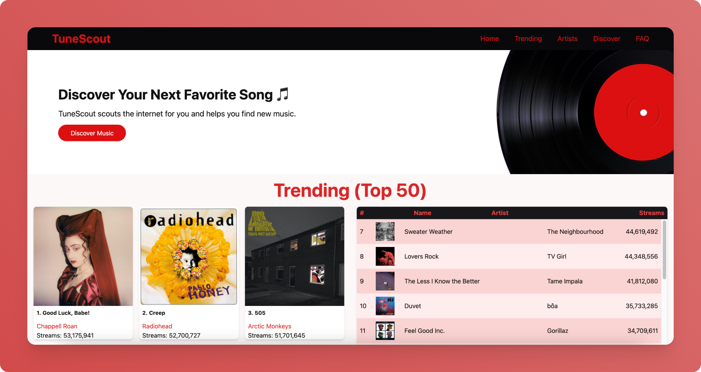

<div align="center">
  <h1>Tunescout 💿</h1>
</div>



TuneScout is a React application that surfaces trending music and artist insights by combining data from Last.fm and Spotify. Users can explore top charts, drill into rich track and artist detail, and sample music directly through Spotify embeds.

## Features

- Browse the current Last.fm top tracks and artists with rich metadata
- On-demand detail modals with Spotify previews, tags, and listener statistics
- Artist pagination and keyboard-accessible interactions throughout
- Discover page that searches Spotify for tracks and albums
- Responsive layout styled with Tailwind CSS

## Getting Started

### Prerequisites

- Node.js 18+ (LTS recommended)
- npm 9+ (ships with recent Node releases)
- Spotify Developer credentials (Client ID and Client Secret)
- Last.fm API key

### Installation

```bash
npm install
cp .env.example .env
# populate the environment variables in .env
```

### Environment variables

| Variable | Description |
| --- | --- |
| `REACT_APP_LASTFM_API_KEY` | Last.fm API key used for chart, track, and artist requests |
| `REACT_APP_SPOTIFY_CLIENT_ID` | Spotify client ID for the Client Credentials flow |
| `REACT_APP_SPOTIFY_CLIENT_SECRET` | Spotify client secret for the Client Credentials flow |
| `REACT_APP_BASENAME` *(optional)* | Base path when hosting under a subdirectory (e.g. `/tunescout`) |

None of the credentials are bundled in the repo—make sure to keep your `.env` file out of version control (the included `.gitignore` already handles this).

### Available scripts

```bash
npm start       # start the development server
npm run build   # create an optimized production build
npm test        # launch the test runner
```

### Project structure

```
src/
  components/        # Feature components and UI composition
  services/          # API clients for Spotify and Last.fm
  utils/             # Reusable formatting helpers
```

The data layer has been refactored so API credentials live in environment variables and network calls are performed lazily—details for tracks and artists are only fetched when the user opens a modal, greatly reducing startup load.

## Data sources

- **Last.fm** – powering charts, listener counts, and tagging
- **Spotify** – providing detailed metadata and embeddable previews

Both APIs enforce rate limits. The application caches Spotify tokens in-memory and avoids redundant requests whenever possible, but you should still keep network usage in mind if you're planning high-traffic deployments.

## Deployment

The project ships with `predeploy`, `deploy-normal`, and `deploy-snapshot` scripts that build the app and publish to GitHub Pages. Ensure your environment variables are configured in the build environment before running a deployment.

## Contributing & maintenance tips

- Keep build artifacts (e.g., `build/`, `snapshot-build/`) out of version control—`.gitignore` already excludes them.
- Run `npm run build` locally before deploying to catch compilation errors.
- When modifying data access code, favor the shared utilities in `src/services` to keep error handling consistent.
